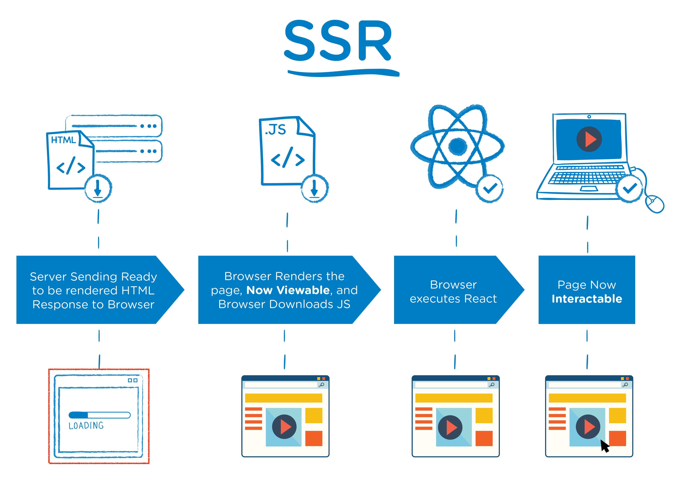

#aor 
### MPA (Multi Page Application)
>[!note]
>#### MPA (Multi Page Application)
>
>>여러 개의 페이지로 이루어진 App

#### **SSR**(Server Side Rendering) 렌더링 방식
- 서버측에서 요청을 받은 후, 서버단에서 렌더링 준비를 마친 상태가 되면 클라이언트에 전달

#### 장/단점
장점
   - SEO(Search Engine Optimization) - 검색엔진 최적화 유리
   - FE 영역과 BE 영역을 느슨하게 연결 가능
   - 첫 페이지 로딩 시간이 짧음
단점
   - 작은 변화에 전체 페이지 렌더링, 비효율적
   - 첫 페이지를 제외한 나머지 페이지들의 로딩 시간이 느림
   - 서버에 부하가 많음

### [React](../../../Dev-Index/React.md) Index로 돌아가기